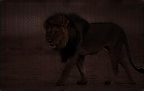
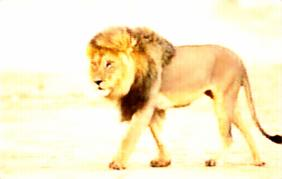

# 🌓 Conditional GAN for Image Light Enhancement

A PyTorch implementation of a Conditional Generative Adversarial Network (cGAN) for adjusting image lighting conditions. This model can convert normal-light images to either low-light or bright-light conditions using controllable conditioning.

<div align="center">
  <table>
    <tr>
      <td><b>Original Image</b></td>
      <td><b>Low Light Image</b></td>
      <td><b>Bright Light Image</b></td>
    </tr>
    <tr>
      <td></td>
      <td></td>
      <td></td>
    </tr>
  </table>
</div>

## ✨ Features

<div align="center">

| Feature | Description |
|---------|------------|
| 🔄 Bidirectional Adjustment | Convert normal → bright or normal → low-light |
| 🎚️ Conditional Control | Parameter range (-1.0 to 1.0) for light intensity |
| 📊 Training Data | LOL-v2 dataset (Real and Synthetic) |
| 🚀 Versatile | Supports both training and inference modes |

</div>

## Dataset Structure

The project uses the LOL-v2 dataset with the following structure:
```
dataset/LOL-v2/
    Real_captured/
        Train/
            Normal/
            Low/
            Bright/
        Test/
            Normal/
            Low/
            Bright/
    Synthetic/
        Train/
            Normal/
            Low/
            Bright/
        Test/
            Normal/
            Low/
            Bright/
```

> To get the bright images run the `generate_bright.py`

```bash
python3 generate_bright.py
```

> Then modify the image names by running `remove_prefix.py`
```bash
python3 remove_prefix.py
```

## Usage

### 🛠️ Installation

<details>
<summary>1. PyTorch (with CUDA)</summary>

```bash
pip install torch torchvision --index-url https://download.pytorch.org/whl/cu124
```
</details>

<details>
<summary>2. All other dependencies</summary>

```bash
pip install -r requirements.txt
```
</details>

### Training

To train the model from scratch:

```bash
python3 train_cgan.py
```

### 🔍 Testing

<details>
<summary>Convert single image with specific condition</summary>

```bash
# Convert to bright image
python3 test_cgan.py --input path/to/normal/image.jpg --output output/bright_image.jpg --condition 1.0

# Convert to low-light image
python3 test_cgan.py --input path/to/normal/image.jpg --output output/low_image.jpg --condition -1.0
```
</details>

<h3 align="center">✨ OR ✨</h3>

<details>
<summary>Convert to both conditions at once</summary>

```bash
python3 single_image_convert.py --input sample/lion.jpeg --output-dir output --model checkpoints/best_model.pth
```
</details>

### Model Architecture

#### Generator
- Encoder-decoder architecture with skip connections
- Input: Normal-light image + condition value
- Output: Generated image with adjusted lighting

#### Discriminator
- Convolutional neural network
- Input: Image + condition value
- Output: Real/Fake prediction

## Checkpoints

The model saves two types of checkpoints in the `checkpoints` directory:
- `latest_checkpoint.pth`: Latest training state
- `best_model.pth`: Best performing model based on generator loss
